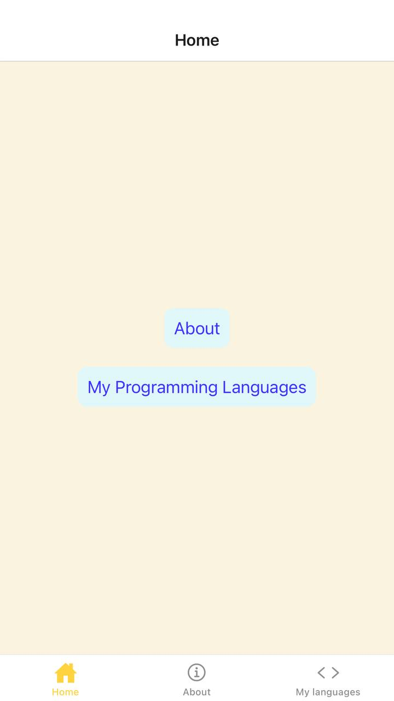
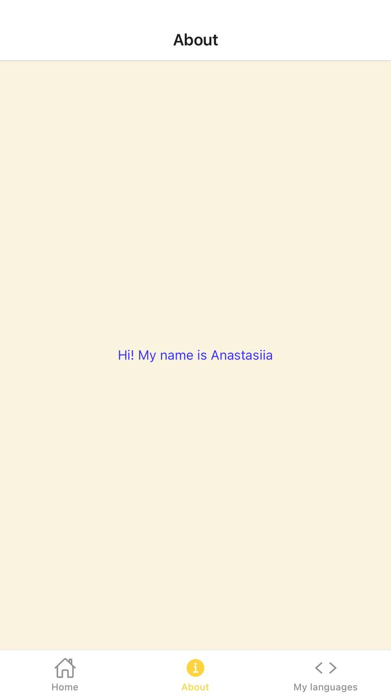
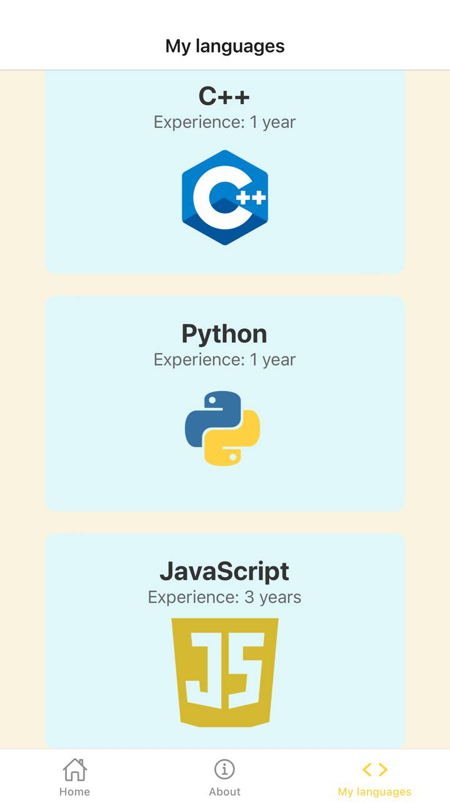

# Mobile Navigation Practice

This is a mobile application built with **React Native** and **Expo** that is path of the React Native learning process. The app provides multiple tabs, each showing different sets of data and offering navigation options between them.

## Features

- **Home Screen**: Displays a list of buttons that navigate to different pages of the app.
- **About Tab**: Contains information about the creator.
- **Languages Tab**: Displays a list of programming languages you know, along with their respective logos and experience levels.
- **Not found page**: Handles unknown routes by displaying a "Page Not Found" screen.

## Technologies Used

- **React Native**: A framework for building native apps using React.
- **Expo**: A framework and platform for universal React applications.
- **React Navigation**: Used for navigating between different tabs and pages in the app.

## Setup and Installation

To get started with this app, follow these steps:

1. Clone the repository:
   ```bash
   git clone git@github.com:AnastasiiaXX/mobile-navigation-practice.git

2. Install the dependencies:
    ```bash
    cd mobile-navigation-practice
    npm install

3. Run the app on your local device:
    ```bash
    npm start

You can scan the QR code generated by Expo in the terminal or use the Expo Go app to open the app.

Below are shown the screenshots of how the app may look like.

Home Screen:



About Tab:



Languages Tab:

